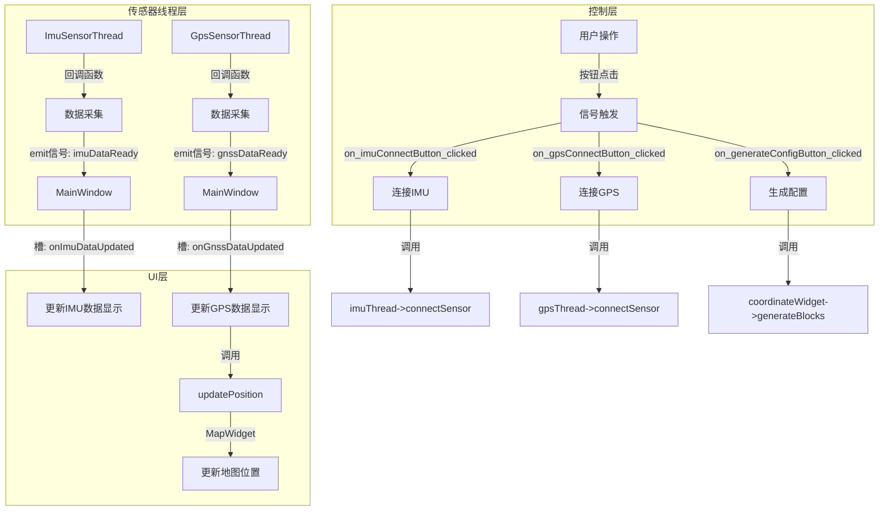
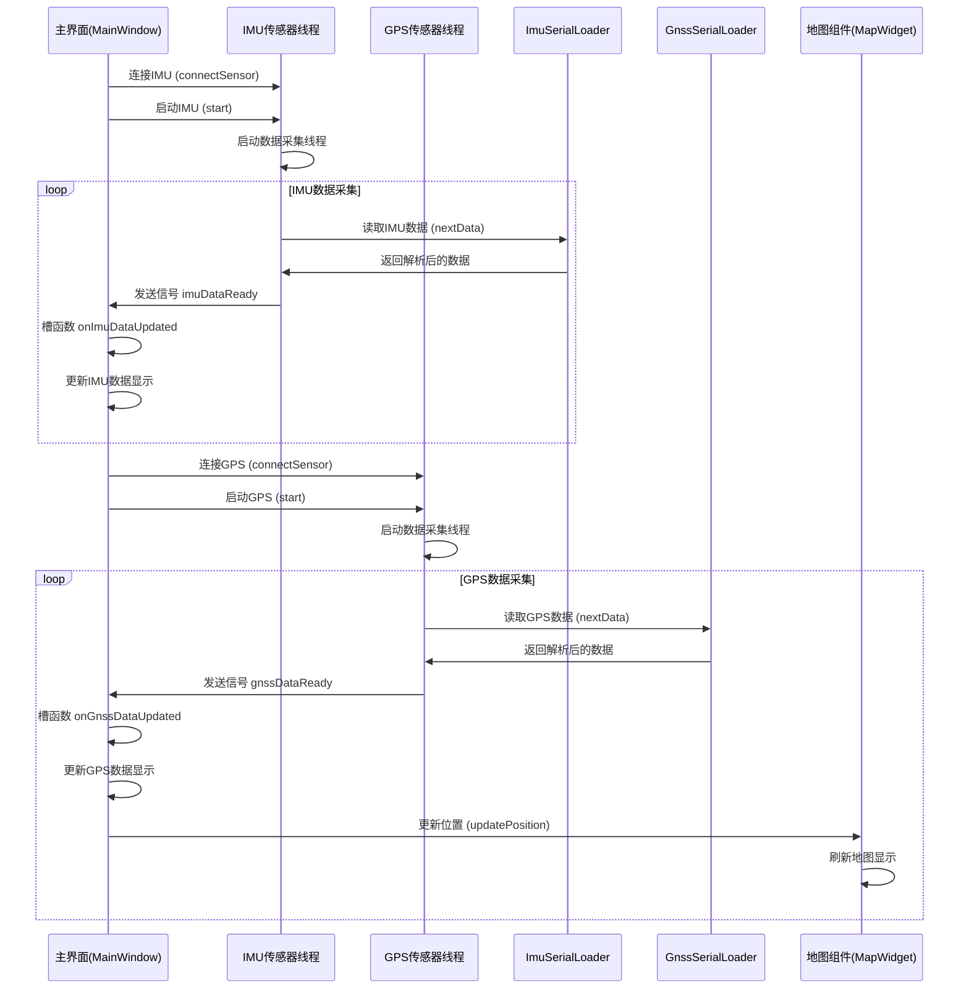
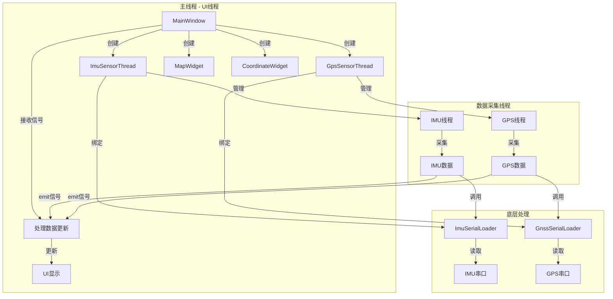
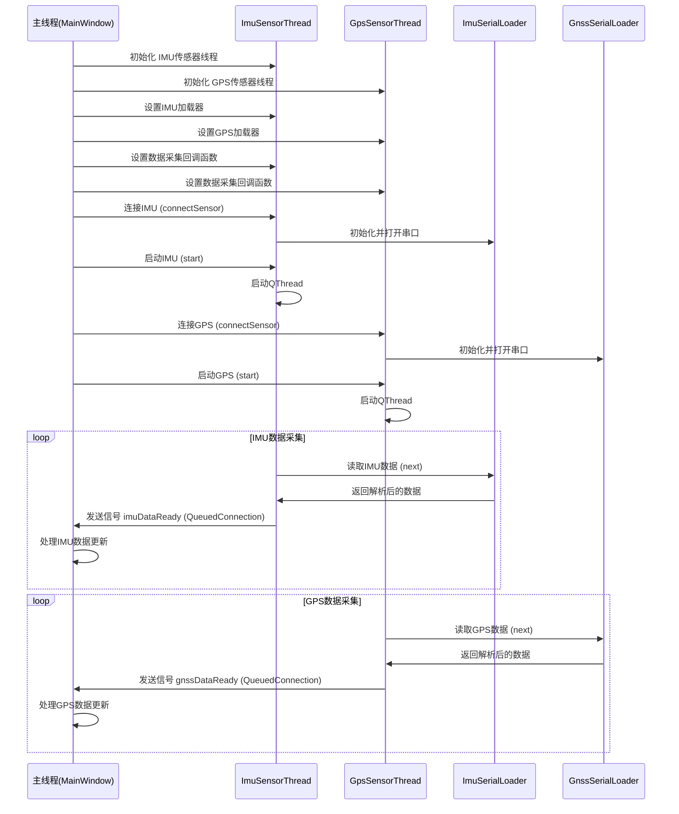

# 信号槽与多线程调用关系示意图

## 一、信号槽机制示意图

### 1. 核心信号槽关系



### 2. 信号触发流程



## 二、多线程调用关系示意图

### 1. 线程架构



### 2. 多线程数据流向



## 三、关键技术点说明

### 1. 信号槽连接方式

- **线程内连接**：使用默认连接方式，适用于同一线程内的信号槽
  ```cpp
  // 连接IMU数据信号槽
  connect(this, &MainWindow::imuDataReady,
          this, &MainWindow::onImuDataUpdated);
  
  // 连接GPS数据信号槽
  connect(this, &MainWindow::gnssDataReady,
          this, &MainWindow::onGnssDataUpdated);
  ```

- **跨线程连接**：传感器线程与主线程之间的连接通过回调函数中的emit信号实现，Qt会自动处理跨线程连接

### 2. 多线程管理

- **传感器线程**：使用SensorThread基类，为IMU和GPS分别创建独立线程
  ```cpp
  // 初始化IMU传感器线程
  imuThread = std::make_unique<ImuSensorThread>(this);
  // 设置默认串口参数
  imuThread->setSerialParams("COM7", 115200);
  // 创建IMU加载器实例
  auto imuLoader = new ImuSerialLoader("COM7", 115200);
  imuThread->setLoader(imuLoader);
  ```

- **回调函数**：使用std::function作为回调函数，实现数据采集逻辑
  ```cpp
  // 设置IMU传感器线程的数据采集回调函数
  imuThread->setDataCollectionFunc([this]() {
      LOG_INFO("IMU data collection started");
      try {
          while (imuThread->isRunning() && imuThread->isConnected()) {
              // 获取下一条IMU数据
              void* data = imuThread->nextData();
              if (data) {
                  // 处理IMU数据
                  IMU* imuData = static_cast<IMU*>(data);
                  LOG_DEBUG("Received IMU data: time=%f", imuData->time);
                  // 发送IMU数据更新信号
                  emit imuDataReady(*imuData);
              }
              // 添加微小休眠，减少CPU占用
              QThread::msleep(4);
          }
      } catch (const std::exception& e) {
          LOG_ERROR("Exception in IMU data collection: %s", e.what());
      } catch (...) {
          LOG_ERROR("Unknown exception in IMU data collection");
      }
      LOG_INFO("IMU data collection stopped");
  });
  ```

- **异常处理**：在数据采集回调函数中添加异常处理，确保线程稳定运行

### 3. 数据流向

1. **传感器数据** → 传感器线程回调函数 → emit信号 → MainWindow槽函数
2. **用户操作** → MainWindow信号 → 调用传感器线程方法 → 控制传感器
3. **数据更新** → MainWindow槽函数 → 更新UI组件 → 显示数据和地图

### 4. 性能优化

- **微小休眠**：在数据采集循环中添加微小休眠，减少CPU占用
  ```cpp
  // 添加微小休眠，减少CPU占用
  QThread::msleep(4); // IMU线程
  QThread::msleep(1); // GPS线程
  ```

- **异常处理**：添加全面的异常处理，确保系统稳定性
  ```cpp
  try {
      // 数据采集逻辑
  } catch (const std::exception& e) {
      LOG_ERROR("Exception in IMU data collection: %s", e.what());
  } catch (...) {
      LOG_ERROR("Unknown exception in IMU data collection");
  }
  ```

## 四、代码结构参考

### 1. 核心文件

- **mainwindow.cpp**：主界面实现，包含信号槽连接和UI更新逻辑
- **sensorinterface.h/cpp**：传感器线程实现，包括SensorThread基类和派生类
- **imuserialloader.h/cpp**：IMU数据加载器，负责读取和解析IMU数据
- **gnssserialloader.h/cpp**：GPS数据加载器，负责读取和解析GPS数据
- **mapwidget.cpp**：地图组件，负责显示位置和轨迹

### 2. 关键函数

- **initModules()**：初始化各个模块，包括传感器线程
- **initSensorThreads()**：初始化传感器线程回调函数
- **initSignalsSlots()**：初始化信号槽连接
- **onImuDataUpdated()**：处理IMU数据更新
- **onGnssDataUpdated()**：处理GPS数据更新
- **SensorThread::start()**：启动传感器线程
- **SensorThread::connectSensor()**：连接传感器

## 五、总结

本项目采用了Qt的信号槽机制和多线程技术，实现了传感器数据的实时采集、处理和显示。通过合理的线程管理和信号槽连接，确保了系统的稳定性和响应速度，同时优化了CPU占用和异常处理，提升了整体性能。

### 关键技术特点

1. **模块化设计**：将传感器线程、数据加载器、UI更新等功能分离到不同模块，提高代码可维护性

2. **线程安全**：通过信号槽机制实现线程间通信，确保数据安全传递，避免线程同步问题

3. **异常处理**：在数据采集线程中添加全面的异常处理，提高系统稳定性

4. **性能优化**：通过微小休眠减少CPU占用，确保系统流畅运行

5. **灵活配置**：支持通过回调函数自定义数据采集逻辑，提高系统扩展性

信号槽机制使得代码结构清晰，模块间耦合度低，便于维护和扩展。多线程技术则保证了数据采集的实时性，避免了主线程阻塞，提升了用户体验。这种设计模式是Qt应用程序中处理传感器数据的最佳实践。