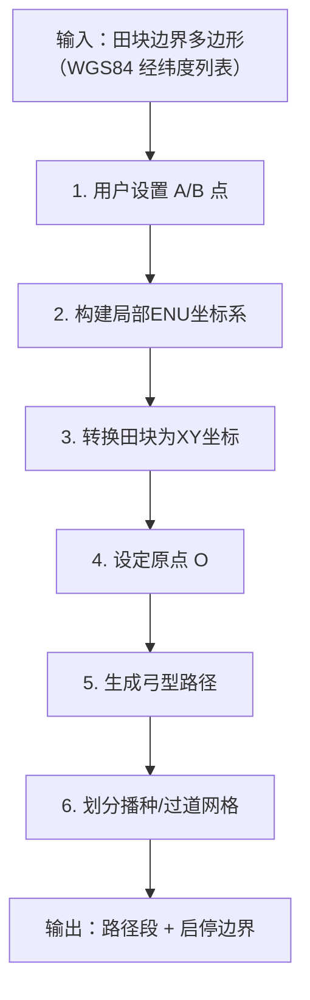

# 软件架构

项目核心挑战在于：在存在 GPS 定位误差和系统延迟的前提下，如何实现厘米级的播种启停控制。以下从建模、算法选择、误差补偿、系统架构四个维度进行严谨分析，并给出高效简洁的解决方案。

本项目需要用到的核心库包括：
- Qt Serial Port： Qt Serial Port 该模块为配置、I/O 操作以及获取和设置 RS-232 引脚的控制信号提供了基本功能。
- Qt Positioning： Qt Positioning API 可让您通过各种可能的来源（包括卫星、wifi 或文本文件）确定位置。这些信息可用于确定地图上的位置等。此外，您还可以使用 API 检索卫星信息并执行区域监控。
- Qt Location：Qt Location 模块可帮助您使用流行的位置服务提供商（如Open Street Map）提供的数据创建地图解决方案。
- Qt SQL： Qt SQL 模块为 SQL 数据库提供支持。Qt SQL该模块的应用程序接口分为不同的层：驱动层  SQL API 层  用户界面层
- Qt Graphs：通过Qt Graphs 模块，您可以将数据可视化为二维和三维图形。

---

## 一、问题建模

### 1.1 田块与路径结构

- 田块为矩形区域：$[X_{\min}, X_{\max}] \times [Y_{\min}, Y_{\max}]$
- 规定：沿着播种机行进方向为Y轴
- 初始化时，定义原点O，为（0,0）点。定义Y轴正方向，可通过磁方位角$\theta$，计算得到Y轴正方向，也可以通过点A，连线OA得到Y轴正方向。O点和A点都是在田块内的点，由经纬度表示
- 定义X轴正方向，为Y轴正方向逆时针90度。完成本地坐标的构建之后，就可以根据本地坐标，计算出任意点的经纬度坐标，并实现经纬度与本地坐标的转换


- 沿着播种机行进方向，形成平行的田垄，播种时需要将种子播到垄上，垄与垄之间是沟，用于灌溉
- 本播种机为四垄播种机，可以同时为四个田垄播种
- 田垄之间的间距为“垄矩” 0.6米，这个参数可以设置
- 播种划分的小区，是一个品类的种子播种的最小单位，一个小区有两个田垄的宽度，长度一般为 5 米，长度参数可以设置


- 播种时，前后小区之间，未播种的小段区域，称为过道，过道的宽度一般为 1 米，这个参数可以设置
- 播种路径为“弓”字形（shuttle pattern）：
  - 沿 Y 轴方向往复行进（主作业方向）
  - 每完成一趟播种，在 X 方向平移 4 个垄距，再往复播种，由于本播种机为 4 垄 播种机，所以每趟可以播种4个垄
- **过道（headland skip）**：
  - 在 Y 轴方向周期性出现（例如每 5米 留 1 米长过道）
  - 过道区域**不播种**
  - 过道垂直于行进方向（即平行于 X 轴）

### 1.2 控制目标
- 在**进入播种区时** → 精确触发 `start_seeding`
- 在**进入过道区时** → 精确触发 `stop_seeding`
- 触发点位置误差 ≤ ±2 cm（行业要求）

### 1.3 干扰因素
| 因素 | 影响 |
|------|------|
| GPS 定位噪声 | 位置抖动 ±5~10 cm（RTK 可达 ±2 cm） |
| 系统延迟 | 从 GPS 获取 → 决策 → 执行，延迟 100~500 ms |
| 速度变化 | 播种机变速导致距离计算偏差 |
| 航向偏差 | 实际轨迹偏离理想直线 |

### 1.4 软硬件模块
- GPS导航模块，通过串口连接，接收GPS定位数据
- IMU模块，通过串口连接，接收IMU数据
- 播种机控制模块，通过串口连接，发送播种指令
- 上位机：本系统运行在PC上，接收硬件模块的信息，负责处理数据，计算提前量，发送控制指令
---

## 二、核心难点：滞后与误差下的“提前量”控制

由于存在**延迟**，若在到达边界时才决策，实际执行时已越过边界。因此必须采用**预测+提前触发**策略。

> **关键思想**：不是“当前位置是否在边界”，而是“未来 T 秒后是否会跨过边界”。

---

## 三、推荐算法：基于运动预测的**前馈-反馈混合触发机制**

### ✅ 算法名称：**Predictive Boundary Crossing with Hysteresis**

#### 步骤 1：建立理想作业网格（Offline）
- 预先生成所有**播种段**和**过道段**的 Y 坐标区间：
  ```python
  # 示例：行距 = 0.3m, 过道宽度 = 1.0m, 每 10 行一过道
  row_spacing = 0.3
  rows_per_block = 10
  headland_width = 1.0

  seeding_intervals = []  # [(y_start, y_end), ...]
  current_y = Y_min
  while current_y < Y_max:
      block_end = min(current_y + rows_per_block * row_spacing, Y_max)
      seeding_intervals.append((current_y, block_end))
      current_y = block_end + headland_width  # 跳过过道
  ```

#### 步骤 2：实时状态估计（Online）
使用**卡尔曼滤波（Kalman Filter）** 或 **低通滤波 + 速度估计**，对 GPS 位置和速度进行平滑：
```cpp
// 状态向量: [x, y, vx, vy]
// 输入: GPS (x_gps, y_gps) + IMU/轮速（可选）
// 输出: 平滑后的位置 (x_f, y_f) 和速度 (vx, vy)
```
> 若无 IMU，可用一阶低通滤波 + 差分速度估计（需注意噪声放大）。

#### 步骤 3：预测未来位置（关键！）
设系统总延迟为 $T_d$（可通过标定获得，如 0.3s），当前速度为 $v_y$，则：
- **预测位置**：$ y_{\text{pred}} = y_f + v_y \cdot T_d $

#### 步骤 4：判断是否即将跨越边界
- 遍历 `seeding_intervals`，找到当前所在区间
- 计算到**最近上下边界**的距离：
  - 若向下行驶（$v_y < 0$）：关注下边界 $y_{\text{low}}$
  - 若向上行驶（$v_y > 0$）：关注上边界 $y_{\text{high}}$
- 若 $ |y_{\text{pred}} - y_{\text{boundary}}| < \epsilon $（如 1 cm），且跨越方向正确，则触发指令

#### 步骤 5：引入迟滞（Hysteresis）防抖
- 设置开启/关闭的**不同阈值**，避免在边界附近反复切换：
  - `start_seeding` 触发点：进入播种区 **+2 cm**
  - `stop_seeding` 触发点：进入过道区 **-2 cm**
- 或使用状态机：
  ```cpp
  enum State { SEEDING, STOPPED };
  if (state == STOPPED && y_pred > y_boundary + hysteresis) {
      start_seeding();
      state = SEEDING;
  }
  if (state == SEEDING && y_pred < y_boundary - hysteresis) {
      stop_seeding();
      state = STOPPED;
  }
  ```

---

## 四、增强措施（提升鲁棒性）

### 4.1 动态延迟补偿
- 实测系统端到端延迟 $T_d$（从 GPS 时间戳到执行器响应）
- 可通过注入测试信号标定（如突然转向，记录响应时间）

### 4.2 航向对齐校正
- 实际行进方向可能偏离 Y 轴
- 将位置投影到**当前行进方向的法线方向**上，再判断边界
  ```math
  d_{\perp} = (P - P_0) \cdot \hat{n}
  ```
  其中 $\hat{n}$ 为行方向的法向量（理想为 X 轴方向）

### 4.3 使用 RTK-GPS + IMU 融合
- RTK-GPS 提供厘米级定位（水平 ±1~2 cm）
- IMU 提供高频姿态与加速度，弥补 GPS 更新率低（10 Hz vs IMU 100+ Hz）
- 推荐使用 **RTKLIB + EKF 融合** 或 商业方案（如 u-blox F9P + ADIS16470）

### 4.4 路径预加载与索引优化
- 将 `seeding_intervals` 构建为**区间树**或**有序列表**，支持 O(log n) 快速查找当前区间
- 对于矩形田块，可直接用数学公式计算所属区间（无需遍历）：
  ```python
  block_index = floor((y - Y_min) / (rows_per_block * row_spacing + headland_width))
  within_block_y = (y - Y_min) % (rows_per_block * row_spacing + headland_width)
  is_seeding = within_block_y < rows_per_block * row_spacing
  ```

---

# 初始化流程

## 一、整体初始化流程概览



---

## 二、详细步骤实现

### 步骤 1：用户交互设定 A、B 点（地理坐标）

- 用户在地图界面点击两个点：
  - **A 点**：起始参考点（如田块左下角）
  - **B 点**：方向参考点（沿主作业方向）
- 输入：`A = (lat_A, lon_A)`, `B = (lat_B, lon_B)`

> ✅ 要求：A ≠ B，且距离 > 5 米（避免数值不稳定）

---

### 步骤 2：构建局部 ENU 坐标系（East-North-Up）

将 WGS84 地理坐标转换为以 A 点为原点的**局部平面直角坐标系（ENU）**：

#### 2.1 使用 **ENU 投影公式**（适用于小范围田块 < 10 km²）
```python
from math import radians, cos, sin, sqrt, atan2

def wgs84_to_enu(lat, lon, lat0, lon0):
    # lat0, lon0: reference point (A)
    R = 6378137.0  # Earth radius in meters
    dlat = radians(lat - lat0)
    dlon = radians(lon - lon0)
    x = R * dlon * cos(radians(lat0))   # East
    y = R * dlat                        # North
    return x, y
```

> 📌 注：更精确可用 **PROJ 库** 或 **GeographicLib**，但 ENU 对农田足够（误差 < 1 cm / km）

#### 2.2 定义作业坐标系（X/Y）
- 将 **A→B 向量**作为 **Y 轴正方向**
- **X 轴**为 Y 轴逆时针旋转 90°（即垂直向右）

```python
# 计算 AB 向量（ENU 下）
xB, yB = wgs84_to_enu(lat_B, lon_B, lat_A, lon_A)
vec_AB = (xB, yB)
norm = sqrt(xB*xB + yB*yB)
unit_Y = (xB / norm, yB / norm)          # Y 轴单位向量
unit_X = (-unit_Y[1], unit_X[0])         # X 轴 = Y 逆时针转90°
```

#### 2.3 构建坐标变换矩阵
任意点 P 的 ENU 坐标 `(e, n)` 可转换为作业坐标 `(X, Y)`：
```math
\begin{bmatrix}
X \\
Y
\end{bmatrix}
=
\begin{bmatrix}
\text{unit\_X}_x & \text{unit\_X}_y \\
\text{unit\_Y}_x & \text{unit\_Y}_y
\end{bmatrix}
\cdot
\begin{bmatrix}
e - e_A \\
n - n_A
\end{bmatrix}
```
由于 A 是原点，`e_A = n_A = 0`，故简化为：
```python
def enu_to_xy(e, n):
    X = unit_X[0] * e + unit_X[1] * n
    Y = unit_Y[0] * e + unit_Y[1] * n
    return X, Y
```

---

### 步骤 3：转换田块边界为 XY 坐标

- 输入：田块边界多边形 `[(lat_i, lon_i)]`
- 输出：凸多边形 `[(X_i, Y_i)]`（作业坐标系）

> ✅ 验证：使用 **凸包算法**（如 Graham Scan）确保为凸多边形（农业田块通常为凸）

---

### 步骤 4：设定原点 O（播种起始点）

- **原点 O 必须位于田块内**
- 推荐策略：
  - 沿 Y 轴最小值处（`Y_min`）
  - 在 X 方向居中或按用户指定
- 实现：
  ```python
  Y_min = min(p[1] for p in field_polygon_xy)
  # 找 Y ≈ Y_min 的边，取其中点作为 O
  candidates = [p for p in field_polygon_xy if abs(p[1] - Y_min) < 0.1]
  if candidates:
      O_x = sum(p[0] for p in candidates) / len(candidates)
      O_y = Y_min
  else:
      # 投影法：从 (0, Y_min) 向上射线求交
      O_x, O_y = compute_entry_point(field_polygon_xy, Y_min)
  ```

> ⚠️ 原点 O 将作为 **弓型路径的起点**

---

### 步骤 5：生成弓型路径（Shuttle Pattern）

#### 输入参数：
- `row_spacing`：行距（m），最小单位 0.1 m（如 0.3）
- `headland_width`：过道宽度（m），最小单位 0.1 m（≥1.0）
- `min_seeding_length`：有效播种段最小长度（0.2 m）

#### 算法流程：

1. **计算 Y 轴覆盖范围**：
   ```python
   Y_min = min(p[1] for p in field_polygon_xy)
   Y_max = max(p[1] for p in field_polygon_xy)
   ```

2. **沿 Y 轴生成扫描线（每行中心线）**：
   ```python
   current_y = O_y
   rows = []
   while current_y <= Y_max:
       rows.append(current_y)
       current_y += row_spacing
   ```

3. **对每行，计算与田块的交线段**：
   - 使用 **多边形裁剪**（如 Sutherland–Hodgman）求水平线 `y = row_y` 与田块的交集
   - 得到若干线段 `[(x_start, x_end), ...]`（通常为 1 段）

4. **合并相邻行，形成“块”（block）**：
   - 每 `N` 行构成一个播种块（如 N=10）
   - 块之间插入 `headland_width` 宽的过道

5. **过滤短段**：
   - 若某行交线长度 < `min_seeding_length`（0.2 m），则跳过（不播种）

6. **生成路径序列**：
   - 奇数行：从左 → 右
   - 偶数行：从右 → 左
   - 路径点存储为 `(X, Y)` 列表

> ✅ 输出：`path_segments = [(y_start, y_end, is_seeding), ...]`  
> 其中 `is_seeding = True` 表示该 Y 区间为播种区，否则为过道

---

### 步骤 6：划分网格（用于启停控制）

为支持厘米级启停，将 Y 轴离散化为 **0.1 m 网格**（满足行距最小单位）：

```python
grid_step = 0.1  # 米
Y_grid = np.arange(Y_min, Y_max + grid_step, grid_step)

# 标记每个网格单元是否属于播种区
seeding_mask = []
for y in Y_grid:
    # 判断 y 是否落在任一播种块内
    in_seeding = any(block.y_start <= y <= block.y_end for block in seeding_blocks)
    seeding_mask.append(in_seeding)
```

> 📌 此网格用于后续实时判断：`if seeding_mask[i]: start_seeding()`

---

### 步骤 7：参数约束与校验

| 参数 | 约束 | 处理方式 |
|------|------|--------|
| 行距 | ≥0.1 m，步长 0.1 m | 四舍五入到 0.1 m 倍数 |
| 过道宽 | ≥1.0 m，步长 0.1 m | 同上 |
| 最小播种段 | ≥0.2 m | 自动跳过短段 |
| 田块非凸 | — | 自动转凸包或报错 |

---

## 三、数据结构设计（C++/Qt 友好）

```cpp
struct FieldPlan {
    QPointF origin;                     // 原点 O (X, Y)
    QVector<QPointF> boundary;          // 田块边界 (XY)
    double rowSpacing;                  // 行距 (m)
    double headlandWidth;               // 过道宽 (m)
    
    struct Block {
        double yStart, yEnd;
        bool isSeeding;
    };
    QVector<Block> blocks;              // 播种/过道块
    
    // 用于实时查询的网格（可选）
    std::vector<bool> seedingGrid;
    double gridStep = 0.1;
    double yMin, yMax;
};
```

---

## 四、与原有控制系统的集成

- 初始化完成后，将 `FieldPlan` 传给 **Predictive Trigger 模块**
- 实时控制时，只需查询当前 `y_pred` 所属的 `Block` 或 `seedingGrid`
- 无需重复几何计算，**运行时开销极低**

---

## 五、扩展

- **支持非矩形田块**：通过多边形裁剪处理凹田块
- **多区域支持**：一个田块含多个独立播种区
- **可视化预览**：在 Qt 中绘制 XY 坐标系下的路径与过道

---

## 六、界面设计

在以下文档中进行了界面设计： docs\界面设计.md  


